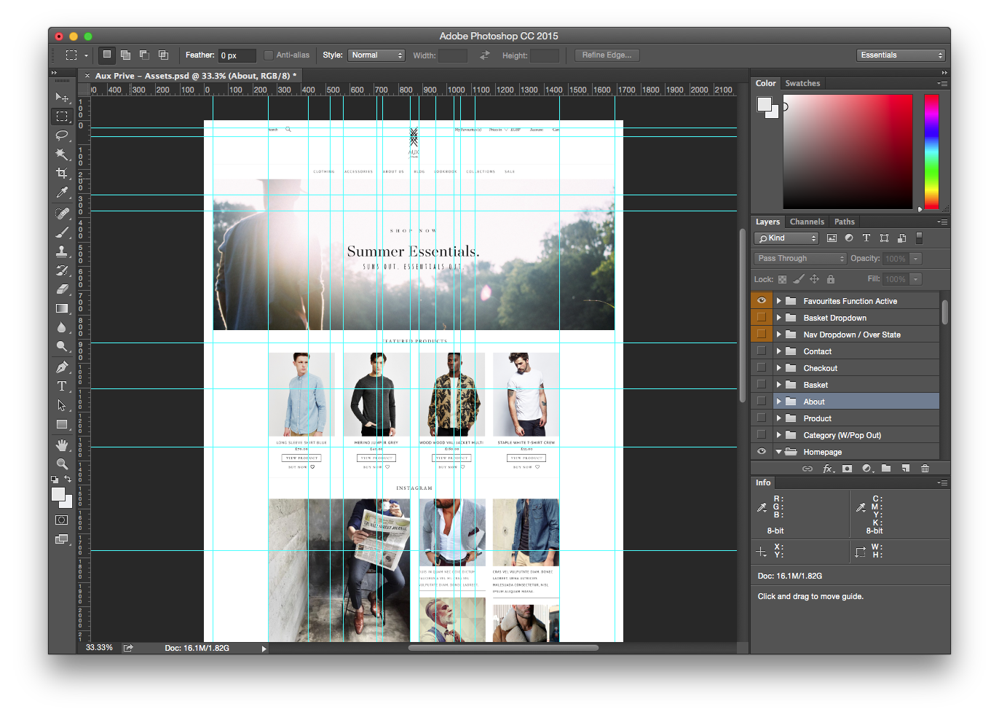
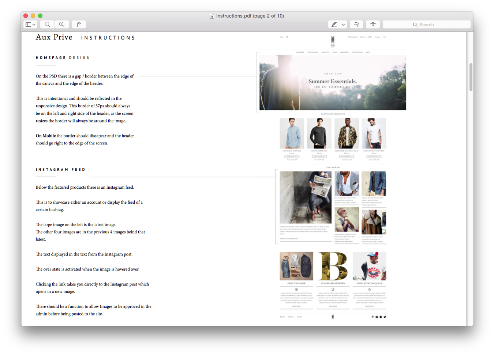

.. title:: Assets & Instructions

Assets & Instructions
=====================

Most of the time development work starts with an initial set of assets, they come in different
formats depending on the complexity of the job but usually they will be PSDs for big changes and
PDFs for smaller changes or bug fixes.

    Sample PSD design for a new website.

The main goal of developers is to match the final deliverable with the assets provided as closely as
possible, it also helps to provide input *before* the assets are finished to come up with the most
efficient way to code any of its features, this way developers have a rough idea of what to expect
and can prepare in advance.

    Sample PDF with instructions for new website.

In most cases web projects will need mobile features as well, sometimes assets won't include
responsive designs so it's up to developers to manipulate the desktop elements as best as they can
to create the mobile views. The base Magento themes is responsive by default and it's not difficult
to match this with the project styles.

.. note::

    Sometimes it's difficult to match the end result perfectly with the design, if that's the case
    developers can provide alternatives to project managers and designers to come up with a
    different approach that can be used instead.
