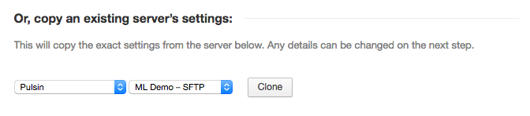
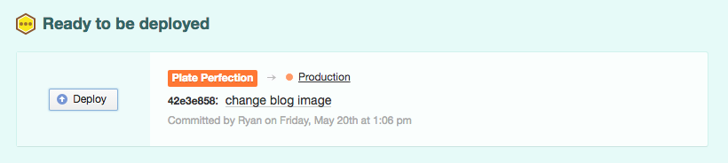

.. title:: Deployment

Deployment
==========

Introduction
------------

Deployments are handled automatically whenever possible so a combination of `DeployBot`_ and the
``rsync`` command is used for new projects and regular FTP/SFTP for older or legacy projects.

After setting up a project with DeployBot it'll help push changes automatically to the Staging
server whenever the repo is updated, for older projects changed files will need to be uploaded
manually.

.. danger::
    Changes **must not** be made directly on the live server.

.. _DeployBot: https://deploybot.com/

Branching Workflow
------------------

We use a branching workflow to make sure changes are deployed to the right environments easily.
Projects should have 2 main working branches:

- **master**: Contains the latest stable code with changes synced to the live server.
- **develop**: Contains the latest changes that are still in development or waiting for review and approval, this branch is synced to the staging server.

All new changes should be made into the **develop** branch, it is recommended that a new local branch is created for
every new task so it's clear what commits need to be merged into master once they are approved.

The process looks like this:

1. You get a new task in asana for a change.
2. Create a local branch from develop, make sure to name it **task/LAST_5_NUMBERS_IN_TASK_URL**. For example, to create a local branch for this task https://app.asana.com/0/11928277286825/429244967265381 you can do ``git checkout -b task/65381``
3. Work like normal, making commits to this branch.
4. Once the work is finished merge branch into develop and push ``git checkout develop && git merge task/65381 && git push``
5. Send task back and wait for approval to go live.
6. If the task needs more work go to step #3 and repeat.
7. If the task is approved cherry pick changes into master and push ``git checkout master && git cherry-pick commit(s) && git push``
8. Deploy changes from DeployBot.
9. Local branch can be deleted at this point.

The benefit of using the task ID in the branch name is that, even if the task comes back after some time, we can quickly
check our work by just looking at the URL and checking out into the branch.

For smaller changes we can work directly on the **develop** branch but it's important to use ``cherry-pick``
to incorporate commits into **master** instead of ``merge``, this will make sure that only your changes
are included and not any other changes in the **develop** branch.

.. note::
    If you want to cherry pick multiple commits into a single one you can use ``git cherry-pick --no-commit``
    to cherry pick changes without automatically committing them.

The main idea to keep in mind is that **develop** and **master** are independent,
changes should not be made directly in **master**.

New projects
------------

A new project needs to be setup in DeployBot to handle automatic deployments, this is usually done
before starting to work on it. Most of the time only 2 servers need to be configured, Staging (or
ML Demo) and the Live server.

The process is very straightforward, there's an option to copy the settings from current projects so
that can be used to quickly configure most servers.

    Copy settings from Staging environment in DeployBot.

There's only a few things to keep in mind:

- For Staging servers the deployment mode can be set as **Automatic** but for Live server this must
  be set as **Manual**.
- Staging servers must be set to track the **develop** branch, Live servers must be set to follow the
  **master** branch.
- Configuration specific files like ``local.xml`` or ``wp-config.php`` files are not tracked in the
  repo so the need to be set as **Configuration files** for each environment.

    Manually deploy latest commits in DeployBot.

Legacy projects
---------------

Older or legacy projects are not tracked using DeployBot so deployments need to be handled manually
via FTP/SFTP.

To help with this the following bash commands can be used to get the files changed in a git repo:

.. code-block:: bash

    # Create archive of changed files in commit
    g2f () {
        if [ -z "$1" ]; then
            echo "Commit reference is required"
            return 1
        else
            git diff-tree -r --no-commit-id --name-only --diff-filter=ACMRT $1 | xargs tar -rf ~/Desktop/diff.tar
        fi
    }

    # Create archive of changed files since commit
    g2ff () {
        if [ -z "$1" ]; then
            echo "Commit reference is required"
            return 1
        else
            git diff-tree -r --no-commit-id --name-only --diff-filter=ACMRT ${1}~..HEAD | xargs tar -rf ~/Desktop/diff.tar
        fi
    }

They can be used as:

- ``g2f COMMIT-SHA`` to get all the changed files in that commit.
- ``g2ff COMMIT-SHA`` to get all the changed files from that commit to the latest one.

Untracked assets
----------------

Some assets are not tracked in the repo but sometimes are necessary to include during the deployment
process, for example the ``media`` directory in Magento or ``uploads`` folder in WordPress.

``rsync`` can be user to upload these files to the target server, for example the following command:

.. code-block:: bash

    rsync -azP media/ mldemo:~/projects/magento/media

Will upload only the changed files in the local ``media`` folder to the one in the ML Demo server.

.. note::
    Each server needs to be setup in the local SSH config for the above command to work.
